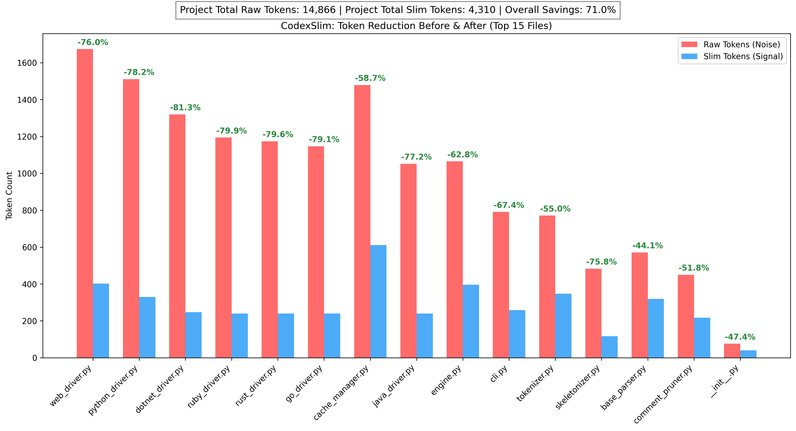

# CodexSlim

**AI token-efficient codebase reduction for LLM agents.**

CodexSlim transforms a codebase into a semantically equivalent but drastically smaller representation — a "skeleton" — that retains everything an LLM agent needs to understand architecture and interfaces, while stripping implementation detail that adds tokens without adding understanding.

> Typical reduction: **80–92% fewer tokens** with no loss of architectural signal.

---

## How it works

CodexSlim uses [Tree-sitter](https://tree-sitter.github.io/) to parse source files into an AST, then extracts only the structural surface: class names, function signatures, type annotations, decorators, and docstrings. Function bodies are replaced with `...`.

**Input** (8 lines, ~60 tokens):
```python
def calculate_tax(amount: float, region: str) -> float:
    """Calculate tax for a given amount and region."""
    # Lookup regional tax table
    rate = TAX_RATES.get(region, DEFAULT_RATE)
    # Apply tiered calculation
    if amount > 10000:
        return amount * rate * TIER_2_MULTIPLIER
    return amount * rate
```

**Output** (2 lines, ~15 tokens):
```python
def calculate_tax(amount: float, region: str) -> float:
    """Calculate tax for a given amount and region."""  ...
```

---

## Requirements

- Python **3.9** or higher
- pip **22+** (run `pip install --upgrade pip` if unsure)

### System dependencies

| Platform | Requirement |
|---|---|
| macOS | Xcode Command Line Tools: `xcode-select --install` |
| Linux | `gcc` and `python3-dev`: `sudo apt install gcc python3-dev` |
| Windows | Visual C++ Build Tools (for Tree-sitter compilation) |

---

## Installation

### 1. Clone the repository

```bash
git clone https://github.com/sinchan302/CodexSlim.git
cd CodexSlim
```

### Quick Setup

For an instant one-click setup, just run the setup script. It will automatically check your Python environment, create a virtual environment, and install the library and dependencies:

```bash
./setup.sh
```

### Manual Setup (Alternative)

If you prefer to set up the environment manually instead:

**1. Create a virtual environment**

```bash
python3 -m venv .venv
source .venv/bin/activate        # macOS / Linux
.venv\Scripts\activate           # Windows
```

### 3. Upgrade pip

```bash
pip install --upgrade pip
```

> **Important:** pip 21.x (shipped with Python 3.9 on macOS) does not support `pyproject.toml`-based editable installs. Always upgrade pip first.

### 4. Install CodexSlim

**For users** (library only):
```bash
pip install -e .
```

**For contributors** (includes pytest, mypy, ruff):
```bash
pip install -e '.[dev]'
```

### 5. Verify installation

```bash
slim --help
```

You should see the CLI usage output. If you see `command not found`, make sure your virtual environment is activated.

---

## Installing Tree-sitter language support

Tree-sitter language grammars are required for accurate parsing. They are listed as a dependency and should install automatically, but if you see parser errors, install them explicitly:

```bash
pip install tree-sitter-languages
```

Verify it works:
```bash
python3 -c "from tree_sitter_languages import get_parser; print('tree-sitter ok')"
```

If this fails on macOS, make sure Xcode tools are installed:
```bash
xcode-select --install
```

---

## Quick start

### Slim a directory

```bash
# Generate skeleton source files into ./slim-output/
slim ./src --format skeleton --out ./slim-output

# Generate a single SLIM.md manifest (best for injecting into an agent)
slim ./src --format manifest --out SLIM.md
```

### Slim a single file

```bash
slim ./src/auth/user.py --format skeleton
```

### Show token savings

```bash
slim ./src --verbose
```

Output:
```
CodexSlim  →  src/
  src/auth/user.py       87.3% saved
  src/core/engine.py     91.1% saved
  src/models/order.py    84.6% saved

14 files processed  ·  9 cache hits  ·  88.4% token savings overall
```

### Focus on one file with its dependencies

```bash
# Include the target file + everything it imports (1 hop)
slim ./src --focus auth/user.py --dep-depth 1

# Include 2 hops of transitive imports
slim ./src --focus auth/user.py --dep-depth 2
```

---

## CLI reference

```
slim <target> [options]
```

| Option | Default | Description |
|---|---|---|
| `--format` | `skeleton` | Output format: `skeleton`, `manifest` |
| `--out` | auto | Output path (directory for skeleton, file for manifest) |
| `--dep-depth` | `1` | Dependency graph inclusion depth |
| `--grace-period` | `24` | Cache eviction grace period in hours |
| `--tokenizer` | `openai` | Token counter: `openai`, `anthropic`, `both` |
| `--no-cache` | off | Disable cache, always re-parse |
| `--verbose` | off | Print per-file token savings |

### Examples

```bash
# Emit skeleton files, report savings for both OpenAI and Anthropic tokenizers
slim ./src --format skeleton --tokenizer both --verbose

# CI: strict cache eviction, no grace period
slim ./src --grace-period 0 --verbose

# Disable cache entirely (useful for benchmarking)
slim ./src --no-cache --verbose
```

---

## Benchmarks

CodexSlim consistently achieves **70–90% token reduction** across supported languages by stripping raw implementations while perfectly isolating critical architectural signals.

Below is a benchmark visualization targeting CodexSlim's own internal parsers and runtime engine components.



You can run your own local project benchmarks at any time using the bundled utility:
```bash
python benchmark.py
```

---

## Python API

```python
from pathlib import Path
from codexslim.core.engine import Engine

engine = Engine(workspace_root=Path("./my-project"))
result = engine.run(target=Path("./my-project/src"))

for slim_file in result.files:
    print(f"{slim_file.source_path}: {slim_file.token_reports[0].savings_pct}% saved")
    print(slim_file.slim_source)

print(f"Overall: {result.overall_savings_pct}% token savings")
```

### Slim a single file

```python
from pathlib import Path
from codexslim.core.engine import Engine

engine = Engine(workspace_root=Path("."))
slim_file = engine.run_file(Path("src/auth/user.py"))

if slim_file:
    print(slim_file.slim_source)
```

---

## Output formats

### `skeleton` (default)

Preserves the original directory structure with bodies replaced by `...`. Drop-in replacement for raw files — agents that traverse a file tree get the same paths and import structure.

```
slim-output/
├── auth/
│   └── user.py       ← skeleton version
├── core/
│   └── engine.py     ← skeleton version
```

### `manifest`

A single `SLIM.md` file — module index, signatures, and docstrings in one document. Best for injecting the entire codebase understanding into a single agent context window.

```markdown
# SLIM.md — CodexSlim manifest

> Generated by CodexSlim · 14 files · 88.4% token savings

## `auth/user.py`

```python
def get_user(id: int) -> User: ...
def update_user(id: int, data: dict) -> User: ...
```
```

---

## Cache

CodexSlim caches slim digests in a `.codexslim/` folder at the workspace root, keyed by SHA-256 file hash. If a file hasn't changed since the last run, the cached skeleton is returned instantly — no re-parsing.

The cache folder is excluded from git by default (listed in `.gitignore`).

### Cache behaviour

| Scenario | Behaviour |
|---|---|
| File unchanged | Cache hit — returns stored digest |
| File modified | Re-parsed, cache updated |
| File deleted | Marked `pending_eviction`, evicted after grace period |
| New file | Parsed and cached |

### Cache commands

```bash
# Force re-parse everything (ignore cache)
slim ./src --no-cache

# Evict deleted files immediately (useful in CI)
slim ./src --grace-period 0
```

---

## Language support

| Language | Extensions | Status |
|---|---|---|
| Python | `.py` | v1 — full support |
| Java | `.java`, `.gradle` | v1 — full support |
| C# / .NET | `.cs`, `.csproj` | v1 — full support |
| JavaScript / TypeScript | `.js`, `.ts`, `.jsx`, `.tsx` | v1 — full support |
| Go | `.go` | v2 — full support |
| Rust | `.rs` | v2 — full support |
| Ruby | `.rb` | v2 — full support |

Files with no registered parser are passed through unchanged.

---

## Running tests

```bash
# Run all tests
pytest tests/ -v

# Run with coverage
pytest tests/ -v --cov=codexslim --cov-report=term-missing

# Run a specific test file
pytest tests/test_python_parser.py -v
```

---

## Troubleshooting

### `ERROR: File "setup.py" not found. Directory cannot be installed in editable mode`

Your pip is too old. Fix:
```bash
pip install --upgrade pip
pip install -e '.[dev]'
```

### `ModuleNotFoundError: No module named 'parsers'`

The repo root is not on your Python path. Two fixes:

**Option A** — use `PYTHONPATH`:
```bash
PYTHONPATH=. pytest tests/ -v
```

**Option B** — ensure `pyproject.toml` has this section:
```toml
[tool.pytest.ini_options]
testpaths = ["tests"]
pythonpath = ["."]
```

### `BackendUnavailable: Cannot import 'setuptools.backends.legacy'`

The `build-backend` in `pyproject.toml` is wrong. It must be:
```toml
[build-system]
build-backend = "setuptools.build_meta"
```

Not `setuptools.backends.legacy:build`.

### `tree-sitter-languages not installed` in test output

```bash
pip install tree-sitter-languages
python3 -c "from tree_sitter_languages import get_parser; print('ok')"
```

If it still fails on macOS:
```bash
xcode-select --install
pip install --force-reinstall tree-sitter-languages
```

### `ImportError: cannot import name 'X' from 'codexslim.filters.skeletonizer'`

An internal import got corrupted. Check the top of `codexslim/filters/skeletonizer.py` — it should read:
```python
from codexslim.parsers.base_parser import ParseResult, Symbol
```

If it reads anything else (e.g. a doubled or mangled path), restore it to the above.

### `slim: command not found`

Your virtual environment is not activated, or the install failed. Check:
```bash
# Activate venv
source .venv/bin/activate

# Verify slim is installed
which slim
slim --help
```

### Tests collect 0 items

Check that `tests/__init__.py` exists:
```bash
touch tests/__init__.py
pytest tests/ -v
```

---

## Project structure

```
codexslim/
├── core/
│   ├── engine.py          # Main orchestrator
│   ├── cache_manager.py   # File hash → slim digest store
│   └── tokenizer.py       # Token counting and savings report
├── parsers/
│   ├── base_parser.py     # Abstract base: Symbol, ParseResult, BaseParser
│   ├── python_driver.py   # Tree-sitter Python parser
│   ├── java_driver.py     # Tree-sitter Java parser
│   ├── dotnet_driver.py   # Tree-sitter C# / .NET parser
│   ├── web_driver.py      # Tree-sitter JS/TS parser
│   ├── go_driver.py       # Tree-sitter Go parser
│   ├── rust_driver.py     # Tree-sitter Rust parser
│   └── ruby_driver.py     # Tree-sitter Ruby parser
└── filters/
    ├── skeletonizer.py    # Converts ParseResult → slim source
    └── comment_pruner.py  # Strips inline comments
```

---

## Contributing

1. Fork the repo and create a branch: `git checkout -b feature/java-driver`
2. Install dev dependencies: `pip install -e '.[dev]'`
3. Make your changes
4. Add tests for new parsers following the pattern in `tests/test_python_parser.py`
5. Run `pytest tests/ -v` and ensure all tests pass
6. Run `ruff check .` for linting
7. Open a pull request

---

## License

MIT — see [LICENSE](LICENSE) for full terms.
